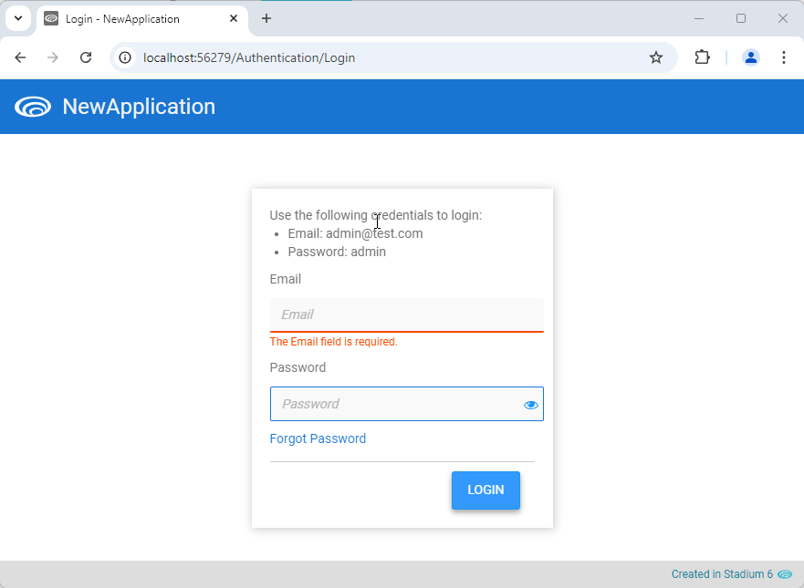

# Role-Specific StartPage <!-- omit in toc -->

Sometimes we want users with specific roles to have specific landing pages. 



# Version
Initial 1.0

# Setup

## Global Script
1. Create a Global Script called "RoleSpecificStartPages"
2. Add the input parameters below to the Global Script
   1. RolePages
3. Drag a *JavaScript* action into the script
4. Add the Javascript below into the JavaScript code property
```javascript
/* Stadium Script v1.0 https://github.com/stadium-software/role-specific-startpage */
let roles = ~.Parameters.Input.RolePages || [];
let userRoles = Session.LoggedInUser.Roles;
for (let i=0; i<roles.length;i++){
    if (userRoles.includes(roles[i].role)) {
        window.location.href = roles[i].page;
        break;
    }
}
```

## Type Setup
1. Create a type called "RolePage"
   1. role (any)
   2. page (any)

## Page
1. Create landing pages you wish to redirect to when users log in

## Users & Roles Setup
1. Create roles to match the landing pages
2. Assign the landing pages to the roles
3. Assign users to the roles

## Page.Load
1. Add a *List* to the load event handler of your StartPage (e.g. StartPage.Load)
2. Set the type of the *List* to "RolePage"
3. For each list item, specify a role and a page pair
4. Order the List items to match your needs. Users will be redirected to the page associated with the **first** role they also have

## Working with Stadium Repos
Stadium Repos are not static. They change as additional features are added and bugs are fixed. Using the right method to work with Stadium Repos allows for upgrading them in a controlled manner. How to use and update application repos is described here 

[Working with Stadium Repos](https://github.com/stadium-software/samples-upgrading)